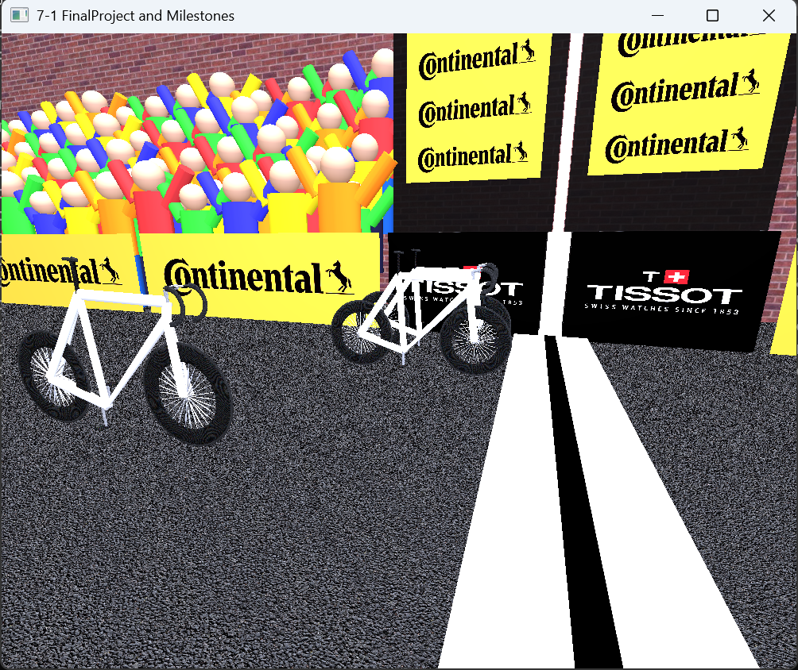

# Sprint Finish 3D Scene

**Author:** Rhys Rathbun

---

## Project Preview

---

## Project Summary

This project implements a modular, low-polygon 3D sprint-finish cycling environment using OpenGL. The emphasis is on structural accuracy, reusable geometry systems, lighting realism using the Phong shading model, and iterative architectural refinement.

Rather than modeling high-detail meshes, the scene prioritizes proportion, repetition, parametric construction, and scalable design.

---

## Course Framework and My Contributions

This project was developed using a course-provided OpenGL framework and primitive mesh classes. My work focused on building and refining the final scene, including the bicycle rendering system, centralized frame geometry, parametric handlebar construction, object transformations, materials and textures, lighting configuration, multi-bike positioning, and iterative refactoring of the scene architecture.

---

## Key Features

- Modular bicycle rendering system
- Centralized frame anchor calculations
- Parametric arc-based handlebar construction
- Multi-bike sprint composition
- Reusable primitive-based geometry
- Directional and point lighting (Phong model)
- Structured transformation and material pipeline

---

## Technical Stack

- **Language:** C++
- **Graphics API:** OpenGL
- **Math Library:** GLM (OpenGL Mathematics)
- **Shaders:** GLSL
- **Lighting Model:** Phong Shading
- **Development Environment:** Visual Studio

---

## Repository Structure

- `/Source` – Scene rendering logic and object assembly
- `/3DShapes` – Primitive mesh implementations
- `/Utilities` – Shaders and textures
- `/screenshots` – Project preview images
- [`Design-Decisions.pdf`](Design-Decisions.pdf) – Project documentation
- `README.md` – Project overview and reflection

---

## How to Run

1. Open the solution in Visual Studio.
2. Build the project in Release mode.
3. Run the executable.
4. Use keyboard and mouse input to navigate the 3D environment.

---

# Reflection

## Overview

This project represents the culmination of my work in computational graphics. I created a low-polygon sprint-finish scene using modular OpenGL primitives. Rather than focusing on high-detail mesh modeling, I emphasized proportion, repetition, lighting realism, and reusable structural systems.

As development progressed, I discovered that building a stable 3D environment required repeated refactoring of earlier work. Many improvements came from strengthening existing systems rather than expanding feature count.

---

## Designing Software

Effective design begins with defining constraints and building around consistent reference systems. Early in the project, my focus was on getting geometry to render correctly. As the bicycle system became more complex, I recognized that scattered calculations and duplicated alignment logic would not scale.

A major improvement was centralizing frame anchor calculations into a shared structure. Originally, components calculated their own positional logic. When I added new elements such as the seatpost, cockpit, and pedals, inconsistencies appeared. Refactoring to a unified anchor system ensured that all structural elements referenced the same geometric foundation. This eliminated duplicated math and made the model easier to scale and adjust.

I also decoupled dependent relationships—for example, separating wheel radius from the ground plane size. Earlier versions tied these values together based on the assumption that everything could scale from the platform size, which caused unintended proportion changes when the environment was modified. Isolating those parameters improved predictability and stability.

Scope management was another important design decision. I initially planned to include rider models, but experimentation showed they reduced visual cohesion and increased complexity. Narrowing the focus allowed for a more polished and technically sound final scene.

---

## Developing Programs

My development process evolved from “making it render” to designing systems intentionally. Adding new objects frequently exposed weaknesses in previously completed code. Instead of layering fixes on top of fragile logic, I refactored existing systems to improve long-term stability.

The steering assembly is a strong example. The handlebar geometry required multiple revisions as I adjusted arc direction, curvature depth, and positional alignment. Early versions technically rendered but produced inverted curves, visible gaps, or misalignment along the Z axis. Correcting these issues required revisiting the underlying trigonometric calculations and redefining arc centers and sweep angles. These were structural corrections, not new features.

Converting segmented handlebar pieces into parametric arcs also required rethinking how endpoints were computed to maintain smooth transitions. While exploring methods for creating curved objects in OpenGL, I realized that the torus meshes provided in the project could not generate a partial arc. After reviewing examples of parametric curved geometry, I realized I could use a simplified version of the same underlying equation together with cylinder geometry to create a pseudo-mesh capable of generating partial curves.

I also refactored `RenderBicycle` to accept a position parameter instead of relying on a fixed origin. This enabled multi-bike sprint rendering without duplicating logic and reinforced the importance of writing reusable systems.

---

## Iteration

Iteration was essential throughout the project. Many refinements focused on strengthening systems that were already functioning but not structurally resilient.

Key refinements included:

- Centralizing frame anchor calculations
- Decoupling geometry parameters to prevent cascading scale issues
- Correcting handlebar arc direction and eliminating clamp gaps
- Adjusting crank and pedal orientation for mechanical realism
- Parameterizing bicycle placement for multi-object rendering

Each milestone improved architectural integrity rather than simply increasing visual complexity. Adding new objects consistently required revisiting earlier assumptions, reinforcing the importance of adaptable design.

---

## Growth

This project strengthened my skills in:

- 3D spatial reasoning
- Parametric geometry construction
- Refactoring for modularity
- Managing interdependent transformations
- Designing reusable rendering systems

I developed a clearer understanding of how small geometric assumptions can create larger downstream issues as systems expand. Refactoring became an essential part of development rather than something to avoid.

Computational graphics deepened my applied understanding of coordinate systems, transformation logic, and structured system design.

---

## Future Impact

The architectural lessons from this project extend beyond graphics. Designing modular systems, centralizing shared calculations, and refactoring when assumptions fail are principles that apply to any complex software system.

From an educational perspective, this experience strengthened my foundation in spatial reasoning and mathematical modeling. Professionally, it reinforced a disciplined approach to building scalable, maintainable systems—an approach that will support future work in simulation, visualization, and advanced computational environments.
